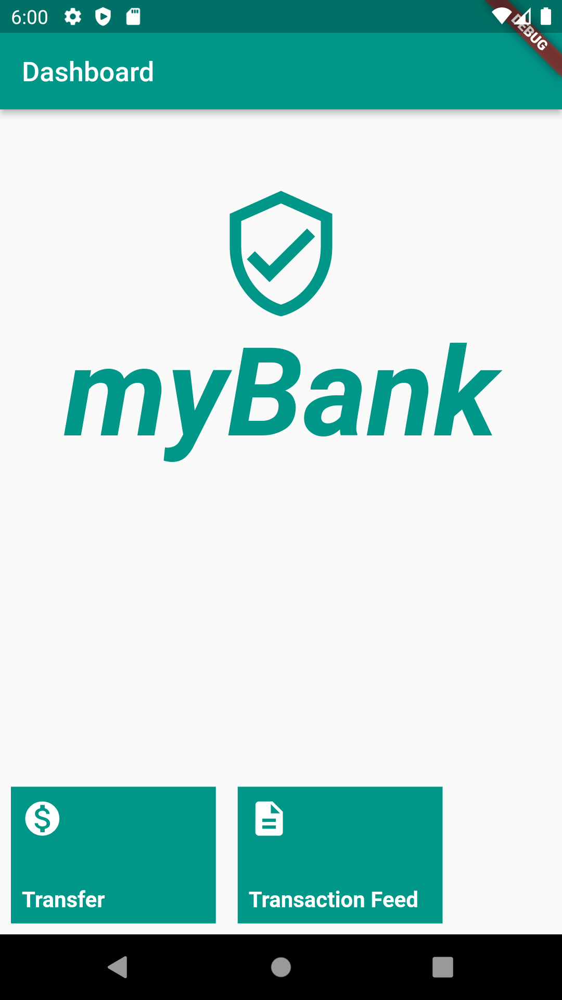
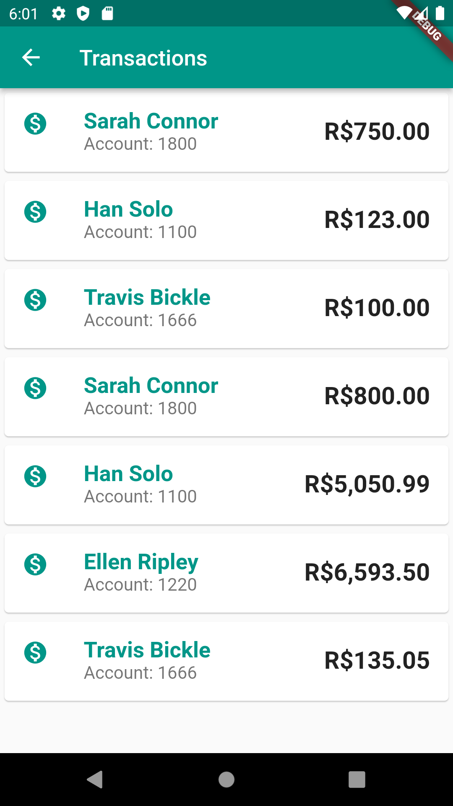
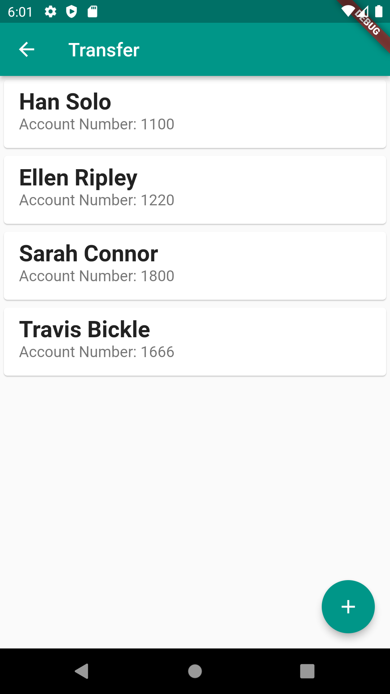
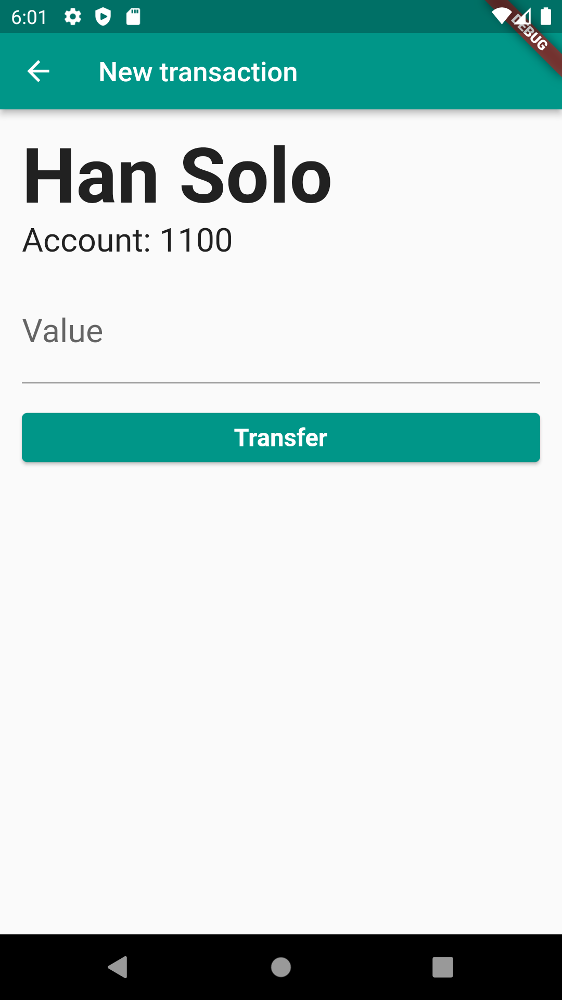
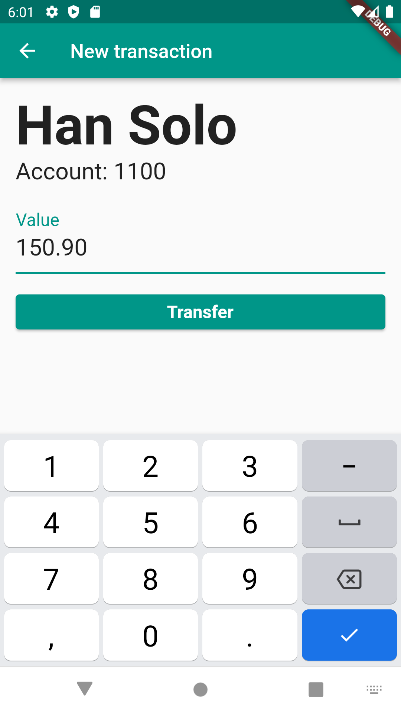
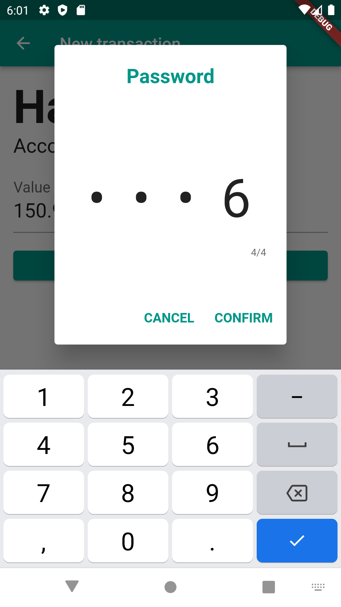
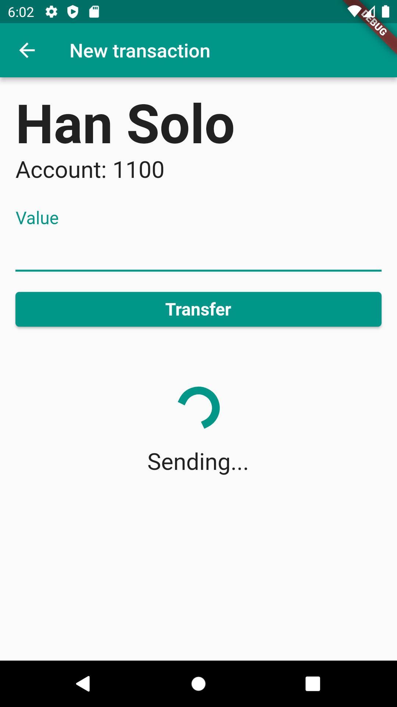
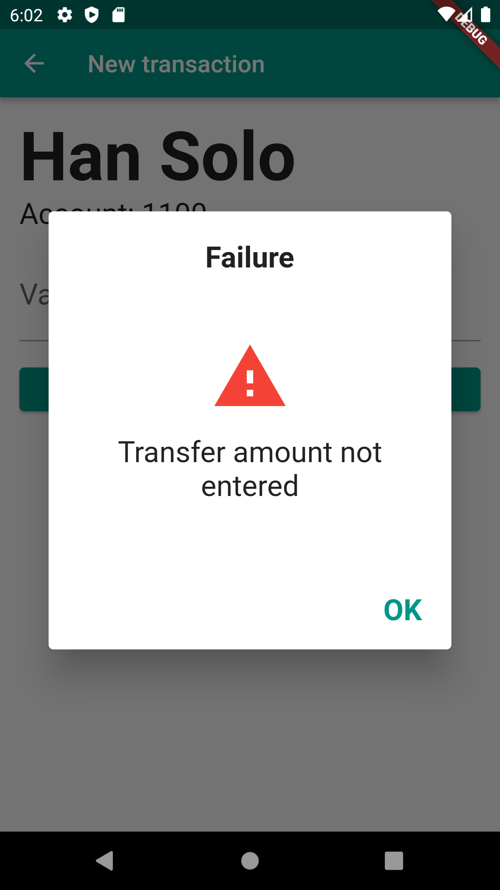
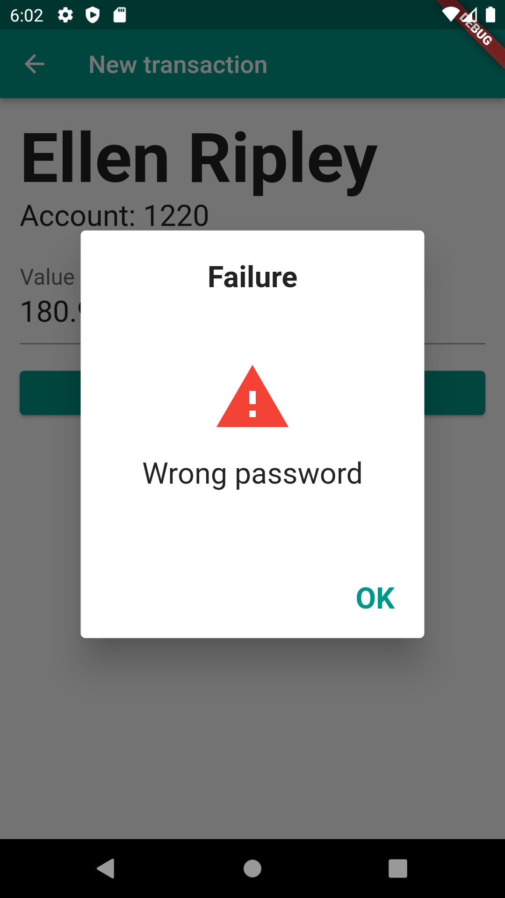
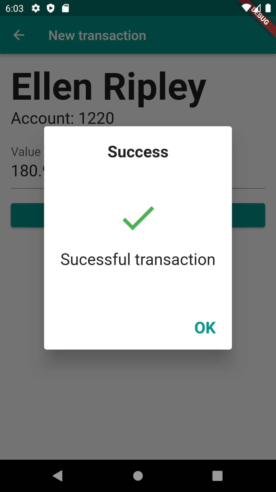

# Firebase Crashlytics

> **obs1.:** Para uso do webApi de exemplo, vá a pasta **WebApiStudies** e no arquivo README tem toda a descrição de utilização.
> 
> **obs2.:** Senha padrão para transferências é o valor 1000. 
> 
> **obs3.:** Alterar a url do `webclient.dart` para o seu ip local `const String baseUrl = 'http://<IP DA SUA MAQUINA AQUI>:8080/transactions';`
>
> **obs4.:** Acesse o site `https://firebase.google.com/` utilizando uma conta google, clique `Começar`, crie um novo projeto e siga os passos, ao fazer o download do arquivo `google-services.json` insira na pasta `mybank/android/app`. Faça os demais passos sugeridos na criação do projeto no Firebase Crashlytics.

## Objetivos ao completar os estudos
- Aprenda o que são exceções
- Aprenda a capturar e gerar exceções corretamente
- Crie diferentes formas de exibir mensagens de erro para os usuários
- Monitore erros de aplicativo e de comunicação HTTP
- Visualize o registro dos erros registrados pelo Crashlytics na aplicação em um dashboard
- Segmente erros por usuários
- Saiba como criar chaves e valores no registro das exceções
- Entenda a parte estratégica da análise de dados de erros para correções inteligentes

## Ementas:

### Exceções e Crashlytics
- Preparando o ambiente
- Exceções, o que são?
- Exceções
- Para saber mais: Bugs, bugs por toda parte!
- Firebase e Crashlytics
- Configuração do Firebase
- Configuração do Crashlytics
- Flutter e Crashlytics
- Faça como eu fiz: Configuração das ferramentas
- O que aprendi?
    - **O que é o Firebase e Crashlytics**
      - Firebase é uma suíte de soluções mantida pela Google e que entrega uma série de funcionalidades para facilitar a vida de desenvolvedores e desenvolvedoras. Uma dessas funcionalidades é o Crashlytics que nos permite registrar em nuvem erros ocorridos em apps.
    - **Como configurar o Firebase e o Crashlytics em um projeto nativo Android**
      - Como o Crashlytics é uma funcionalidade do Firebase, automaticamente ele tem como dependência o próprio. Então, configuramos nativamente importando o Firebase para posteriormente importar o Crashlytics.
    - **Crashlytics e Firebase unidos ao Flutter**
      - Para comunicar erros ocorridos no Flutter ao Crashlytics através da configuração criada no código nativo, instalamos as extensões necessárias no Flutter e através de uma instância do plugin do Crashlytics para Flutter simulamos o primeiro erro fatal no aplicativo.
    - **Console Firebase**
      - O Console Firebase é o responsável por gerar uma forma intuitiva de configurarmos as soluções oferecidas e ver relatórios de uso e registros de erros e gerar comunicação entre aplicativo e Firebase.
    - **Exceções**
      - Aprendemos mais sobre o termo exceção, como podemos gerar e capturar exceções geradas por algum ocorrido inesperado.

### Tipos de exceções
- Exceções de app e HTTP
- Exceções web e de app
- Tipos de exceções HTTP
- Exceções não detectadas
- Faça como eu fiz: Registrando exceções manualmente
- Chaves personalizadas
- Para saber mais: Sincronização de erros
- O que aprendi?
    - **O que é uma exceção de app**
      - Aprendemos o que é uma exceção de app e quais são os momentos em que ela pode ocorrer. Consideramos exceções de app tudo o que está diretamente ligado ao ambiente em que o aplicativo está em contato (sistema operacional, permissões, espaço em disco e memória e afins)
    - **O que é uma exceção web**
      - Aprendemos o que é uma exceção web, erros mais comuns que encontraremos e por quais motivos apesar de serem comportamentos excepcionais as exceções web não são necessariamente um erro e sim um comportamento fora do desejado.
    - **Chaves no Crashlytics**
      - Aprendemos como utilizar as chaves para passar o máximo de informações possíveis sobre o momento em que a exceção foi  registrada para facilitar o processo analítico e a tomada de decisão com relação ao ocorrido para a aplicação de futuras correções.
    - **Cadastro de exceções não detectadas**
      - Como vimos, nem tudo são erros. Também existem comportamentos não desejados que consideramos errôneos. Logo, podemos  considerar como uma exceção não detectada automaticamente pelo Crashlytics no Flutter e precisamos informar manualmente ao Crashlytics de que queremos que ele registre esta falha através do comando `recordError`.

### Rastreamento de usuários
- Identificadores de usuário
- Modo de debug
- Visualização de dados
- Dashboard do Crashlytics
- Faça como eu fiz: Registrando exceções manualmente
- Para saber mais: Registro de erros
- O que aprendi?

### Mensagem de erro
- Zoned error
- SnackBar
- Tratamento de erro
- Toast
- Faça como eu fiz: Criando o zona de erro, Toast, SnackBar e Giffy Dialog
- Giffy dialog
- Para saber mais: Dark Patterns
- Projeto final do curso
- Conclusão
- O que aprendi?

***

## Flutter project screens - myBank App

